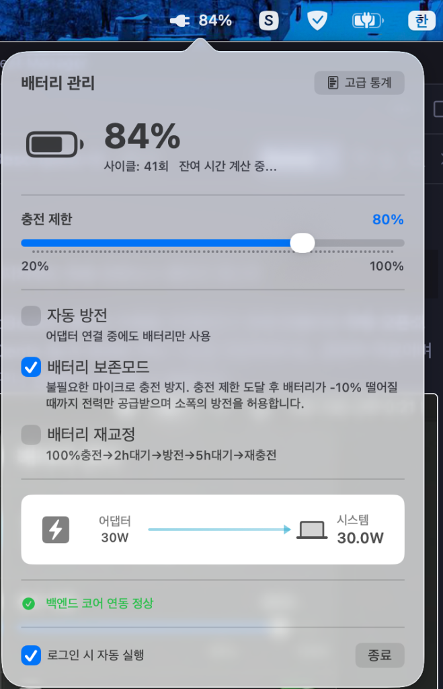
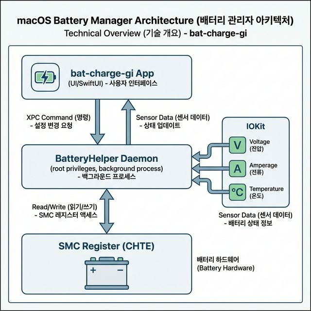

# bat-charge-gi

> MacBook 배터리를 지켜주는 무료 오픈소스 배터리 매니저

**bat-charge-gi**는 MacBook의 배터리 수명을 극대화하기 위해 만들어진 **무료 오픈소스** 앱입니다.
유료 앱(AlDente 등)과 동일한 핵심 기능을 제공하면서도, 완전히 무료이며 코드가 공개되어 있어 누구나 검증하고 기여할 수 있습니다.



---

## 주요 기능

### 충전 제한 (Charge Limiter)
- 배터리 충전 상한선을 자유롭게 설정 (예: 80%)
- Apple Silicon(M1/M2/M3/M4) Mac의 SMC 레지스터를 직접 제어하여 하드웨어 수준에서 충전을 차단
- 어댑터가 연결된 상태에서도 설정한 %를 초과하지 않음

### 강제 방전 (Discharge Mode)
- 어댑터가 꽂혀 있어도 배터리 전력만 사용하도록 강제
- 충전 제한 목표치까지 빠르게 배터리를 낮추고 싶을 때 활용

### 배터리 보존모드 (Sailing Mode)
- 충전 제한에 도달한 후, 불필요한 마이크로 충전(미세 충전 반복)을 방지
- 배터리가 설정값에서 10% 이상 떨어질 때까지 전원만 공급받으며 소폭의 방전을 허용하여 배터리 수명 극대화

### 커스텀 메뉴바 상태 표시
- 기존 macOS 배터리 아이콘을 완벽히 대체하는 커스텀 메뉴바 아이콘
- 배터리 사용 시: 🔋 (잔량별 아이콘 + %)
- 충전 진행 중: ⚡️ (번개 아이콘 + %)
- 전원 어댑터만 사용 중(충전 차단 상태): 🔌 (플러그 아이콘 + %)

### 하드웨어 알림 (Notification)
- USB-C 단일 연결 클램쉘 모드 환경에서 방전 모드 사용 시 모니터 깜빡임 현상을 사전에 경고하는 macOS 알림 센터 연동

### 배터리 캘리브레이션 (Calibration Mode)
- 배터리 잔량(%) 표기 오차를 바로잡기 위한 5단계 자동 사이클
- [완충 → 대기 → 완전 방전 → 대기 → 재충전] 과정을 백그라운드에서 한 차례 수행
- 앱을 종료해도 잔여 과정 타이머는 유지됨
- 참고: 최신 Mac은 자체 배터리 관리가 우선되므로, 잔량 표기 오차가 크게 의심될 때만 선택적으로 사용 권장

### 실시간 전력 모니터링
- **전력 분배 흐름**: 어댑터 → 시스템 / 배터리 전력 흐름을 실시간 표시
- **배터리 사이클 수**: 현재까지의 배터리 충·방전 사이클 횟수 표시
- **잔여 시간**: 충전 완료 또는 배터리 소진까지의 예상 시간

### 고급 배터리 통계 (대시보드)
- 설계 용량, 현재 최대 용량, 배터리 건강도(%)
- 현재 전압(V), 전류(A), 온도(°C)
- 제조사, 시리얼번호 등 상세 하드웨어 정보

---

## 작동 원리



bat-charge-gi는 Apple Silicon Mac의 **SMC(System Management Controller)** 레지스터를 직접 제어합니다.

- **충전 제어**: `CHTE` 레지스터 키를 통해 충전 전류를 하드웨어 수준에서 차단/허용
- **방전 유도**: 충전을 차단한 상태에서 시스템이 배터리 전력만 소모하도록 유도
- **배터리 정보**: `IOKit`의 `AppleSmartBattery` 서비스에서 전압, 전류, 온도, 사이클 수 등을 실시간 파싱

앱 본체는 상단 상태바에 상주하며, SMC 제어를 위한 **권한 데몬**(LaunchDaemon)이 백그라운드에서 별도로 실행됩니다.

---

## 시스템 요구사항

| 항목 | 요구사항 |
|------|---------|
| **macOS** | macOS 13 (Ventura) 이상 |
| **칩셋** | Apple Silicon (M1, M2, M3, M4 시리즈) |
| **권한** | 최초 1회 루트(Root) 데몬 설치 필요 |

> Intel Mac은 SMC 레지스터 구조가 달라 현재 미지원입니다.

---

## 설치 방법

### Homebrew

Homebrew 전용 저장소(Tap)를 등록한 뒤 설치합니다. (최신 Homebrew에서는 `--no-quarantine` 옵션 없이도 앱 내에서 자동으로 권한을 복구하도록 설계되었습니다.)

```bash
brew tap SeongGi/tap
brew install --cask bat-charge-gi
```

#### ⚠️ 타 PC 설치 및 업데이트 오류 시 (강제 재설치)
이전 버전(`2.7.3` 등)의 설치 잔재나 Homebrew 캐시가 남아있어 "Checksum mismatch" 등의 오류가 발생하며 설치가 안 될 경우, 아래 명령어로 기존 Tap 연결을 끊고 최신 상태로 강제 재설치할 수 있습니다.

```bash
brew update
brew untap SeongGi/tap
brew tap SeongGi/tap
brew reinstall --cask bat-charge-gi
```

### 수동 설치

1. [Releases](https://github.com/seonggihub/bat-charge-gi/releases) 페이지에서 최신 `bat-charge-gi.dmg` 다운로드
2. DMG 파일을 열고 앱을 `Applications` 폴더로 드래그
3. 최초 실행 시 macOS가 차단하면: **시스템 설정 → 개인 정보 보호 및 보안 → "확인 없이 열기"** 클릭
4. 앱 내 "백그라운드 제어 권한 허용" 버튼을 클릭하여 Helper 데몬 설치
5. **(앱이 열리지 않거나 차단될 경우)**: 터미널을 열고 아래 명령어를 입력하여 macOS 보안 차단을 강제로 해제합니다.
   ```bash
   sudo xattr -rd com.apple.quarantine /Applications/bat-charge-gi.app
   ```

---

## 안전성

- 배터리 충전 제어는 macOS 및 Apple의 전원 관리 하드웨어가 항상 최종 안전장치로 기능합니다
- SMC 레지스터 조작은 Apple 공식 펌웨어의 보호 범위 안에서 이루어지며, 물리적 손상의 위험은 없습니다
- 앱을 삭제하면 모든 SMC 설정이 원래 상태로 자동 복원됩니다

---

## 라이선스

MIT License — 자유롭게 사용, 수정, 배포가 가능합니다.

---

## 기여하기

버그 리포트, 기능 제안, Pull Request를 환영합니다.

- **Issues**: [GitHub Issues](https://github.com/seonggihub/bat-charge-gi/issues)
- **PR**: Fork 후 Pull Request를 보내주세요

---

<p align="center">
  <b>Made with care for Mac users who value battery health</b>
</p>
